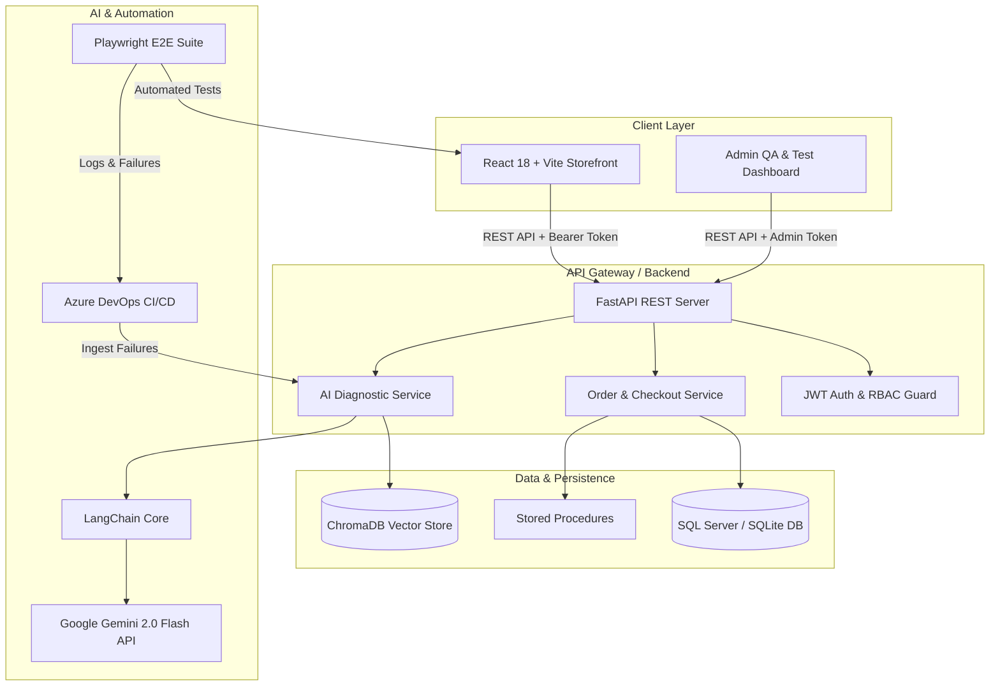

# 🛒 ShopGuard AI: Intelligent E-Commerce Platform & QA Test Observability Engine

[](https://www.python.org/)
[](https://fastapi.tiangolo.com/)
[](https://react.dev/)
[](https://vitejs.dev/)
[](https://tailwindcss.com/)
[](https://www.trychroma.com/)
[](https://www.langchain.com/)
[](https://ai.google.dev/)
[](https://playwright.dev/)
[](https://azure.microsoft.com/services/devops/)

> **ShopGuard AI** is a production-grade full-stack e-commerce application integrated with an AI-driven QA observability and test failure analysis engine. It bridges modern e-commerce transactional flows with automated regression analysis—utilizing **RAG (Retrieval-Augmented Generation)** with **ChromaDB** and **Google Gemini** to diagnose E2E test failures and provide instant root-cause analysis in CI/CD pipelines.

---

## 🌟 Key Features

### 🛒 Modern E-Commerce Core & RBAC
- **Dynamic Catalog & Cart Management:** Real-time stock verification, product filtering, and responsive shopping cart state.
- **Transactional Checkout Engine:** Atomic order processing with inventory locks using optimized database queries and Stored Procedures (`sp_ProcessCheckout`).
- **Role-Based Access Control (RBAC):** JWT-secured authentication distinguishing regular Customers (browsing, order history) from Administrators (product creation, inventory control, QA analytics).

### 🤖 AI-Powered RAG Test Failure Analyzer
- **Historical Failure Embeddings:** Stores Playwright stack traces, error contexts, and fixes inside ChromaDB vector store.
- **RAG Root-Cause Diagnosis:** Fetches semantically similar historical failures to feed context into Google Gemini 2.0 Flash, delivering actionable fix suggestions, confidence scores, and root-cause classification.
- **Offline Rule-Based Fallback:** Resilient fallback engine that provides deterministic diagnostics even when AI endpoints are unreachable.

### 📊 QA Observability & Flaky Test Dashboard
- **Telemetry & Flaky Scoring:** Aggregates automated test runs, calculates failure rates, and tracks flaky test trends over time.
- **Automated Artifact Scanner:** CLI utility to ingest Playwright `error-context.md` files and generate structured root-cause reports (`report.json`).

### 🚀 CI/CD & Automated Quality Gates
- **Azure DevOps Pipeline:** Multi-stage matrix pipeline executing parallel Playwright shards across browser engines, failing fast on regressions, and running automated AI failure triage during build breaks.

---

## 🏛️ System Architecture



---

## 💻 Tech Stack Overview

| Domain | Technologies & Libraries |
|---|---|
| **Frontend** | React 18, Vite, Tailwind CSS, Lucide Icons, Axios |
| **Backend** | Python 3.11+, FastAPI, SQLAlchemy, Pydantic v2, Uvicorn, Passlib (Bcrypt), Python-Jose (JWT) |
| **AI & Vector DB** | Google Gemini 2.0 Flash (`ChatGoogleGenerativeAI`), LangChain, ChromaDB Vector Store |
| **Database** | SQL Server / SQLite (Local), Stored Procedures (`sp_ProcessCheckout`, `sp_GetTestRunStats`) |
| **Testing & QA** | Playwright (12+ E2E test specs), Pytest (Backend unit tests) |
| **DevOps & CI/CD**| Azure DevOps Pipelines (`azure-pipelines.yml`), Docker, Docker Compose |

---

## 🚀 Getting Started & Installation

### Prerequisites
- **Node.js** 20.x or later
- **Python** 3.11 or later
- **Git** installed
- *(Optional)* **Docker Desktop** & **ChromaDB**

---

### 1. Clone Repository & Setup Environment

```bash
git clone https://github.com/your-username/shopguard-ai.git
cd shopguard-ai
```

Create `.env` file in the `backend/` directory:
```env
# Database Settings
DATABASE_URL=sqlite:///./shopguard.db

# Security & JWT
JWT_SECRET=super-secret-dev-jwt-key
JWT_ALGORITHM=HS256
ACCESS_TOKEN_EXPIRE_MINUTES=1440

# AI Services
GEMINI_API_KEY=your_gemini_api_key_here
CHROMA_HOST=localhost
CHROMA_PORT=8000
```

---

### 2. Backend Setup (FastAPI)

```bash
cd backend
python -m venv .venv

# On Windows:
.venv\Scripts\activate
# On macOS/Linux:
# source .venv/bin/activate

pip install -r requirements.txt
uvicorn app.main:app --reload --port 8000
```
> Interactive Swagger API Documentation: [http://localhost:8000/docs](http://localhost:8000/docs)

---

### 3. Frontend Setup (React + Vite)

```bash
cd ../frontend
npm install
npm run dev
```
> Frontend Application: [http://localhost:5173](http://localhost:5173)

---

### 4. Running E2E QA Test Suite (Playwright)

Make sure both the Backend and Frontend servers are running before launching tests:

```bash
cd ../tests/e2e
npm install
npx playwright install chromium
npm test
```

---

### 5. Running with Docker Compose (Full Stack)

```bash
docker compose up --build
```

---

## 🔑 Demo Credentials

| Role | Email | Password | Access Level |
|---|---|---|---|
| **Admin** | `admin@shopguard.dev` | `Admin123!` | Full Access (Products, Orders, QA Dashboard, AI Triage) |
| **Customer** | `customer@shopguard.dev` | `Test123!` | Storefront, Cart, Checkout, Order History |

---

## 🔌 API Endpoints Summary

### Authentication & User Management
- `POST /api/auth/register` — Register a new customer or administrator.
- `POST /api/auth/login` — Authenticate and receive a JWT access token.
- `GET /api/auth/me` — Retrieve the profile of the current authenticated user.

### Storefront & Inventory
- `GET /api/products` — Retrieve list of active catalog products.
- `GET /api/products/{id}` — Get single product specifications and stock.
- `POST /api/products` — Create a new product *(Admin only)*.

### Order Processing
- `POST /api/orders/checkout` — Validate inventory, calculate totals, and place order.
- `GET /api/orders` — List past orders for the authenticated user.

### QA Observability & AI Analyzer
- `GET /api/test-runs` — List historical Playwright test run metrics *(Admin only)*.
- `POST /api/test-runs` — Ingest test execution results and failure logs.
- `GET /api/test-runs/{id}` — Get detailed run breakdowns including stack traces.
- `POST /api/ai/analyze` — Run RAG + Gemini 2.0 Flash diagnostic on a test failure.

---

## 📸 Screenshots & Demonstrations

| Storefront & Cart Experience | Admin QA Dashboard & Flaky Analyzer |
|:---:|:---:|
|  |  |

| AI-Powered Root-Cause Analysis | CI/CD Azure DevOps Pipeline |
|:---:|:---:|
|  |  |

---

## 📄 License & Attribution

Distributed under the **MIT License**. Created as an enterprise portfolio showcase for Full-Stack Development, QA Engineering, and AI System Integration.
